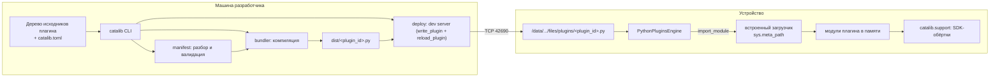

# Implementation Plan: catalib — сборка модульных плагинов exteraGram

> Это живой документ. Обновляется в той же единице работы, что и затрагиваемые им изменения. Отражает текущее состояние принятых решений, а не историю.

## 1. Цель и контекст

exteraGram загружает плагин как ровно один файл `<plugin_id>.py` из каталога плагинов
на устройстве. Разработка нетривиального плагина в одном файле приводит к огромным
модулям с ручными `try/except`-заглушками SDK (пример — `test_plugin/task_manager.py`).

catalib даёт разработчику возможность писать плагин как нормальное дерево пакетов
(папки, подпапки, несколько модулей, тесты) и собирать его в один самодостаточный
`.py`, пригодный для штатной установки и распространения конечным пользователям.
Внутрь собранного файла встраивается компактный загрузчик на основе `sys.meta_path`,
который регистрирует исходные модули плагина в памяти, поэтому обычные `import`
между модулями работают без изменений, а трейсбеки указывают на исходные файлы.

## 2. Объём работ

### Входит в объём

- CLI `catalib` с командами `build`, `watch`, `init`.
- Парсер и валидатор манифеста проекта плагина (`catalib.toml`).
- Статическая AST-валидация метаданных exteraGram (литеральность дандеров,
  совпадение `__id__` с именем выходного файла, формат версий, требования).
- Ядро сборки: обход дерева исходников, компиляция в один `.py` со встроенным
  загрузчиком, слияние `__requirements__`, карта строк для трейсбеков.
- Встраиваемый рантайм-загрузчик (`MetaPathFinder` + `Loader`), регистрирующий
  встроенные модули и подключающий `linecache` для корректных трейсбеков.
- Мини-фреймворк поверх SDK: точка входа плагина, конвенции структуры, декларативная
  регистрация хуков и пунктов меню, типизированные настройки.
- Рантайм-хелперы, бандлящиеся в плагин: безопасные импорты SDK с заглушками для
  офлайн-тестов, утилиты UI-потока, очередей, хуков, настроек.
- Деплой на устройство через dev server exteraGram (TCP 42690, JSON-протокол:
  `write_plugin`, `reload_plugin`, `set_plugin_enabled`, `delete_plugin`) с
  пробросом порта через `adb forward`. Прямой `adb push` в приватный каталог
  без root запрещён (установлено эмпирически, T-011); см. ADR-0004.
- Шаблон проекта (`catalib init`) с примером модульного плагина и pytest-обвязкой.
- Эмпирический зонд на реальном устройстве, подтверждающий применимость
  `sys.meta_path` в среде Chaquopy перед реализацией ядра.
- Полное покрытие тестами и самопроверка сборки.

### Не входит в объём

- Графический интерфейс (только CLI).
- Поддержка бинарных pip-зависимостей (exteraGram принимает только pure-Python
  wheels; ограничение наследуется как есть).
- Публикация пакета в PyPI и настройка внешнего CI (вне границ задачи; локальные
  lint/test обязательны).
- Поддержка иных движков плагинов, кроме Python-движка exteraGram.

## 3. Архитектурное решение

### Тип архитектуры

Модульный монолит — один pip-пакет `catalib` с CLI. Микросервисы неприменимы:
это offline-инструмент сборки без сетевых границ, БД и независимо развёртываемых
компонентов. Обоснование зафиксировано в ADR-0001. Внутренняя структура строго
послойная, каждый слой — отдельный подпакет с единственной ответственностью.

Ключевая особенность: репозиторий содержит **две среды исполнения**.

- **Среда инструмента** (`cli`, `manifest`, `bundler`, `deploy`, `scaffold`) —
  выполняется на машине разработчика на CPython 3.11+.
- **Встраиваемая среда** (`runtime`, `support`) — её исходники попадают внутрь
  собранного плагина и исполняются под Chaquopy 3.11 на устройстве. Этот код
  не имеет права зависеть от пакетов среды инструмента и от чего-либо вне
  стандартной библиотеки и SDK exteraGram.

Граница между средами — жёсткая и проверяется тестами (ADR-0002).

### Механизм модульности

Сборка (bundler) + встраиваемый загрузчик на `sys.meta_path`. Исходники модулей
плагина встраиваются в выходной файл как данные (строки), компактный загрузчик
регистрирует их через `importlib`-finder, исполняя лениво при первом импорте.
Точка входа плагина (подкласс `BasePlugin`) экспортируется на верхний уровень
выходного модуля, чтобы exteraGram нашёл её штатным образом. Обоснование выбора
именно этого механизма и отвергнутые альтернативы — в ADR-0002.

### Мини-фреймворк поверх SDK

catalib задаёт конвенции структуры плагина и тонкий слой над SDK: единая точка
входа, декларативная регистрация хуков и пунктов меню, типизированные настройки,
безопасные импорты SDK. Слой не скрывает SDK, а устраняет повторяющийся
шаблонный код и риск незарегистрированных хуков. Обоснование — ADR-0003.

### Схема системы



## 4. Технологический стек

| Компонент | Технология | Версия | Обоснование |
|-----------|------------|--------|-------------|
| Язык | Python | >=3.11 | Целевая среда Chaquopy — Python 3.11; единый язык инструмента и плагина. |
| CLI-фреймворк | typer | >=0.25,<1 | Зрелый, типобезопасный поверх click, минимум шаблона. Актуальная версия 0.25.1 (апрель 2026). |
| Слежение за файлами | watchfiles | >=1.1,<2 | Rust-бэкенд, кроссплатформенный, debounce, `stop_event`. Актуальная версия 1.1.1. |
| Сборка пакета | hatchling | >=1.29 | Современный стандартный build-backend PEP 517. Актуальная версия 1.29.0. |
| Тесты | pytest | >=8.4 | Де-факто стандарт; ветка 8.4.x актуальна на 2026 год. |
| Покрытие | pytest-cov | >=6 | Интеграция coverage с pytest. |
| Линт и формат | ruff | >=0.9 | Линтер и форматтер в одном инструменте, быстрый. |
| Встраиваемый загрузчик | стандартная библиотека (`importlib`, `linecache`, `sys`) | Python 3.11 | Никаких внешних зависимостей внутри плагина; работает в Chaquopy. |
| Деплой | `adb forward` + dev server exteraGram (TCP 42690, JSON) | — | Прямой `adb push` в приватный каталог без root запрещён; штатный канал — встроенный dev server (ADR-0004). |

Версии сверены через веб-поиск и context7 в мае 2026 года.

## 5. Структура репозитория

```
catalib/
├── pyproject.toml            — метаданные пакета, зависимости, конфиг ruff/pytest
├── Makefile                  — команды верхнего уровня (help, lint, test, build)
├── README.md, CHANGELOG.md, LICENSE
├── src/catalib/
│   ├── __init__.py           — версия, публичный фасад
│   ├── __main__.py           — запуск через python -m catalib
│   ├── cli/                  — слой CLI (typer): app, build, watch, init
│   ├── manifest/             — модель манифеста, загрузка catalib.toml, AST-валидация
│   ├── bundler/              — обход исходников, компиляция, requirements, sourcemap
│   ├── runtime/              — встраиваемый загрузчик (исходник как данные пакета)
│   ├── deploy/               — ADB-обёртка и перезагрузка плагина
│   ├── scaffold/             — генерация шаблона проекта (catalib init)
│   └── support/              — рантайм-хелперы, бандлящиеся в плагин
├── tests/
│   ├── unit/                 — модульные тесты по слоям
│   ├── integration/          — сборка реального примера, проверка импорта
│   └── fixtures/             — образцы деревьев плагинов
└── docs/                     — документация (зеркалит структуру src), планы, ADR
```

## 6. Контракты и интерфейсы

### CLI

- `catalib build [--project DIR] [--out DIR] [--check]` — собрать `<plugin_id>.py`.
- `catalib watch [--project DIR] [--deploy] [--serial S]` — пересборка по изменению,
  опционально автодеплой и перезагрузка на устройстве.
- `catalib init NAME [--dir DIR]` — создать шаблон модульного плагина.

### Манифест `catalib.toml`

```toml
[plugin]
id = "my_plugin"            # = имя выходного файла, литерал, [a-z][a-z0-9_]*
name = "My Plugin"
description = "..."
author = "..."
version = "1.0.0"
icon = "exteraPlugins/1"
min_version = ">=12.5.1"    # __app_version__ / __min_version__
sdk_version = ">=1.4.4"
requirements = ["tinydb"]   # сливается с __requirements__ модулей, pure-python

[build]
src = "src"                 # каталог исходников плагина
entry = "plugin"            # модуль с подклассом BasePlugin
out = "dist"
```

### Публичный API мини-фреймворка (импортируется из плагина)

- `from catalib.support import CatalibPlugin, hook, menu_item, setting` — базовый
  класс плагина и декларативные примитивы.
- `from catalib.support.sdk import ...` — безопасные импорты SDK с заглушками.

Точные сигнатуры фиксируются в `docs/components/` по мере реализации.

## 7. Модель данных

Персистентного хранилища нет. Внутренние модели (в памяти, на время сборки):

- `PluginManifest` — нормализованные метаданные и параметры сборки.
- `SourceModule` — путь, полное имя модуля, исходный текст, признак пакета.
- `SourceTree` — коллекция `SourceModule` плюс точка входа.
- `BundleResult` — текст выходного файла, карта строк, итоговые requirements.

## 8. Безопасность

- Инструмент не работает с сетью и секретами; не исполняет код плагина при сборке
  (только статический разбор через `ast`), что исключает выполнение произвольного
  кода из собираемого проекта на машине сборки.
- Защита от path traversal при обходе дерева исходников: разрешены только пути
  внутри объявленного `src`.
- Деплой через `adb` собирается списком аргументов (без shell-инъекций),
  `plugin_id` валидируется регулярным выражением до использования в путях.
- Встраиваемый загрузчик не использует сеть, не пишет на диск, исполняет только
  встроенные в выходной файл исходники.

## 9. Наблюдаемость

- CLI: структурированный вывод этапов сборки, явные коды возврата
  (0 — успех, ненулевой — ошибка валидации/сборки/деплоя).
- Подробный режим `--verbose`: перечень модулей, размеры, итоговые requirements.
- Встраиваемый загрузчик при фатальной ошибке импорта поднимает исключение с
  исходным трейсбеком (через `linecache`), без молчаливого проглатывания.

## 10. Стратегия тестирования

См. также `references/testing-strategy.md`.

- **Unit** — каждый слой: модель/валидация манифеста, AST-проверки, обход
  исходников, компиляция, формирование загрузчика, слияние requirements,
  построение карты строк, сборка ADB-команд, генерация шаблона. Цель —
  покрытие бизнес-логики близко к 100% по ветвям.
- **Integration** — сборка реального многофайлового примера и исполнение
  получившегося `.py` в подпроцессе CPython 3.11 с эмуляцией вызова движка
  (поиск подкласса, импорт подмодулей, проверка трейсбека на исходный файл).
- **Граница сред** — тест, статически проверяющий, что `runtime`/`support` не
  импортируют пакеты среды инструмента.
- **Деплой** — мокирование подпроцесса `adb`; проверка корректности аргументов.
- E2E на устройстве не автоматизируется (зависимость от железа), но
  поддерживается ручной сценарий через зонд (T-011) и `catalib watch --deploy`.
- Цель по покрытию: не ниже 90% по проекту, бизнес-логика — близко к 100%.

## 11. Развёртывание

Артефакт — pip-пакет (wheel + sdist) через `hatchling`. Локальная установка:
`pip install -e ".[dev]"`. Контейнеризация не требуется (CLI-инструмент).
Внешний CI вне объёма; обязательная локальная самопроверка: `make lint`,
`make test`, успешная сборка примера, ручная проверка зонда на устройстве.

## 12. Риски и допущения

| Риск/допущение | Вероятность | Влияние | Митигация |
|----------------|-------------|---------|-----------|
| Chaquopy ограничивает `sys.meta_path` или импорт-хуки | Низкая | Критическое | Зонд на устройстве (T-011) до реализации ядра; запасной механизм — регистрация модулей напрямую в `sys.modules` через `exec` исходников. |
| Движок берёт точку входа только с верхнего уровня модуля | Средняя | Высокое | Загрузчик экспортирует подкласс `BasePlugin` в пространство имён выходного модуля; зонд подтверждает фактическое поведение `loadPlugin`. |
| Конфликт имён встроенных модулей между плагинами в общем `sys.modules` | Средняя | Высокое | Изоляция: все встроенные модули регистрируются под уникальным приватным префиксом, производным от `plugin_id`. |
| Трейсбеки указывают на сгенерированный файл, а не на исходники | Средняя | Среднее | Регистрация исходников в `linecache` под исходными путями; карта строк. |
| Обновление SDK exteraGram меняет имена/поведение | Средняя | Среднее | `support.sdk` централизует импорты SDK, обёрнутые в `try/except` с заглушками; одна точка адаптации. |
| `adb` отсутствует или несколько устройств | Средняя | Низкое | Понятные ошибки, флаг `--serial`, проверка наличия `adb`. |

## 13. Альтернативы

- **Однонаправленная склейка в один namespace.** Плюсы: предельно просто.
  Минусы: ломаются настоящие пакеты, относительные импорты, `__name__`,
  коллизии имён. Отвергнуто — не масштабируется на реальные плагины.
- **zipapp/base85: записать zip на диск и добавить в `sys.path`.** Плюсы:
  переиспользует штатный импорт. Минусы: запись в общий управляемый каталог,
  замусоривание, очистка только `<plugin_id>.py` движком, медленнее. Отвергнуто.
- **Рантайм-загрузчик из соседней папки (без сборки).** Минусы: работает только
  при ADB-разработке, неприменимо для распространения конечным пользователям.
  Отвергнуто как основной механизм; частично переиспользуется в `watch --deploy`.

Существенные решения вынесены в ADR-0001..0003.

## 14. График и зависимости

Внешних зависимостей от смежных команд нет. Критический путь: зонд на устройстве
(T-011) → ядро bundler → CLI → хелперы → тесты. Зонд выполняется максимально рано,
так как снимает главный технический риск.

## 15. Критерии готовности проекта

- Все шаги в `docs/plans/task-plan.md` имеют статус `done`.
- `make lint` и `make test` зелёные; покрытие соответствует цели.
- Сборка примера из `catalib init` даёт валидный `<plugin_id>.py`, который
  проходит AST-валидацию exteraGram и исполняется в подпроцессе.
- Зонд подтвердил работу механизма на реальном устройстве, результат
  зафиксирован в `docs/architecture/decisions/ADR-0002`.
- Документация в `docs/` актуальна, в каждом компонентном документе есть
  раздел «Связи».
- `CHANGELOG.md` отражает все внешне заметные изменения.

## 16. Связи

- Связанные ADR: ADR-0001 (модульный монолит), ADR-0002 (механизм bundler +
  meta_path), ADR-0003 (мини-фреймворк поверх SDK).
- Связанные документы: `docs/architecture/overview.md`, `docs/plans/task-plan.md`,
  `docs/components/`.
- Внешние ссылки: документация exteraGram `https://plugins.exteragram.app/docs`.
