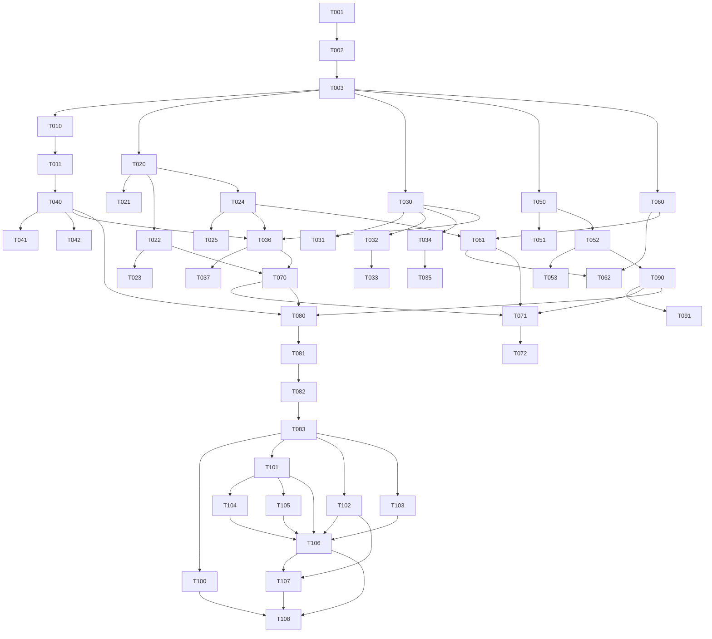

# Task Plan: catalib

> Живой документ. Каждый шаг — атомарная единица работы. Статусы обновляются в той
> же единице работы, где меняется код. Каждая задача завершается коммитом по
> Conventional Commits со ссылкой `Task: T-XXX`.

## Статусы

- `pending` — запланирована.
- `in_progress` — выполняется.
- `done` — завершена, артефакты есть, тесты зелёные, документация обновлена.
- `blocked` — невозможна сейчас; указана причина и что разблокирует.

---

## Раздел 1. Инфраструктура

### T-001: Инициализация репозитория и скелета
- **Статус:** done
- **Описание:** git init, структура каталогов, `.gitignore`, `.gitattributes`,
  `.editorconfig`, `README.md`, `CHANGELOG.md`, `LICENSE`, `pyproject.toml`,
  `Makefile`.
- **Артефакты:** перечисленные файлы, дерево `src/`, `tests/`, `docs/`.
- **Критерий завершения:** репозиторий инициализирован, `make help` работает.
- **Зависит от:** —
- **Блокирует:** все последующие.

### T-002: Планы и ADR
- **Статус:** done
- **Описание:** Implementation Plan, Task Plan, ADR-0001..0003, индекс docs,
  обзор архитектуры, глоссарий.
- **Артефакты:** `docs/plans/*`, `docs/architecture/*`, `docs/README.md`,
  `docs/glossary.md`.
- **Критерий завершения:** документы согласованы между собой.
- **Зависит от:** T-001
- **Блокирует:** —

### T-003: Каркас пакета и конфигурация качества
- **Статус:** done
- **Описание:** `src/catalib/__init__.py` (версия), `__main__.py`, пустые
  `__init__.py` подпакетов; проверка, что `ruff` и `pytest` запускаются.
- **Артефакты:** каркас пакета, `tests/conftest.py`.
- **Критерий завершения:** `make lint` и `make test` проходят на пустом наборе.
- **Зависит от:** T-001
- **Блокирует:** все T-1xx и далее.

---

## Раздел 2. Эмпирический зонд (критический путь)

### T-010: Зонд-плагин для проверки среды Chaquopy
- **Статус:** done
- **Описание:** read-only плагин, логирующий `sys.path`, `__name__`, `__file__`,
  возможность регистрации кастомного `sys.meta_path` finder и импорта через него,
  доступность каталога данных. Сборка вручную (без ядра catalib).
- **Артефакты:** `tests/fixtures/probe/catalib_probe.py`.
- **Критерий завершения:** файл проходит AST-валидацию метаданных exteraGram.
- **Зависит от:** T-003
- **Блокирует:** T-011.

### T-011: Деплой зонда на устройство и снятие результата
- **Статус:** done
- **Описание:** доставка зонда на `NX789J` через dev server (TCP 42690),
  включение, снятие результата файлом из общего хранилища, фиксация
  фактического поведения движка и канала деплоя.
- **Артефакты:** `docs/architecture/evidence/T-011-probe-result.json`,
  дополнение к ADR-0002 (раздел «Эмпирическое подтверждение»), ADR-0004.
- **Критерий завершения:** подтверждено, что кастомный `sys.meta_path`,
  пакеты, относительные импорты и трейсбеки через `linecache` работают в
  Chaquopy. Подтверждено: канал деплоя — dev server, не `adb push`.
- **Зависит от:** T-010
- **Блокирует:** T-040 (ядро runtime).
- **Примечание:** деплой на устройство пользователя — выполняется с его согласия.

---

## Раздел 3. Манифест

### T-020: Доменная модель манифеста
- **Статус:** done
- **Описание:** датаклассы `PluginManifest`, `BuildConfig` с инвариантами
  (валидность `id`, формат версий-ограничений).
- **Артефакты:** `src/catalib/manifest/model.py`.
- **Критерий завершения:** модель создаётся, инварианты выполняются.
- **Зависит от:** T-003
- **Блокирует:** T-021, T-022.

### T-021: Unit-тесты модели манифеста
- **Статус:** done
- **Описание:** тесты инвариантов и граничных случаев.
- **Артефакты:** `tests/unit/manifest/test_model.py`.
- **Критерий завершения:** ветви покрыты, тесты зелёные.
- **Зависит от:** T-020
- **Блокирует:** —

### T-022: Загрузчик `catalib.toml`
- **Статус:** done
- **Описание:** чтение и нормализация манифеста (`tomllib`), понятные ошибки.
- **Артефакты:** `src/catalib/manifest/loader.py`.
- **Критерий завершения:** валидный toml даёт `PluginManifest`, невалидный —
  явную ошибку.
- **Зависит от:** T-020
- **Блокирует:** T-023, T-070.

### T-023: Unit-тесты загрузчика манифеста
- **Статус:** done
- **Описание:** валидные и невалидные манифесты, отсутствующие поля.
- **Артефакты:** `tests/unit/manifest/test_loader.py`, фикстуры toml.
- **Критерий завершения:** тесты зелёные, покрыты ошибки.
- **Зависит от:** T-022
- **Блокирует:** —

### T-024: AST-валидация метаданных exteraGram
- **Статус:** done
- **Описание:** статическая проверка, что в выходном файле дандеры
  (`__id__`, `__name__`, `__version__`, ...) — строковые литералы и
  `__id__` совпадает с именем файла; проверка формата версий.
- **Артефакты:** `src/catalib/manifest/metadata.py`.
- **Критерий завершения:** корректные метаданные проходят, динамические —
  отклоняются с указанием места.
- **Зависит от:** T-020
- **Блокирует:** T-025, T-061.

### T-025: Unit-тесты AST-валидации
- **Статус:** done
- **Описание:** литералы, переменные, вызовы, f-строки, несовпадение `id`.
- **Артефакты:** `tests/unit/manifest/test_metadata.py`.
- **Критерий завершения:** все ветви валидатора покрыты.
- **Зависит от:** T-024
- **Блокирует:** —

---

## Раздел 4. Bundler

### T-030: Обход дерева исходников
- **Статус:** done
- **Описание:** построение `SourceTree` из каталога `src`: модули и пакеты,
  полные имена, защита от path traversal, определение точки входа.
- **Артефакты:** `src/catalib/bundler/discovery.py`,
  `src/catalib/bundler/model.py`.
- **Критерий завершения:** дерево с подпапками корректно отображается в имена.
- **Зависит от:** T-003
- **Блокирует:** T-031, T-032, T-034, T-036.

### T-031: Unit-тесты обхода исходников
- **Статус:** done
- **Описание:** пакеты, подпакеты, пустые каталоги, traversal-атака.
- **Артефакты:** `tests/unit/bundler/test_discovery.py`, фикстуры деревьев.
- **Критерий завершения:** тесты зелёные.
- **Зависит от:** T-030
- **Блокирует:** —

### T-032: Слияние requirements
- **Статус:** done
- **Описание:** сбор `__requirements__` из модулей и манифеста, дедупликация,
  отказ при бинарных пакетах из явного стоп-списка.
- **Артефакты:** `src/catalib/bundler/requirements.py`.
- **Критерий завершения:** объединённый список корректен и детерминирован.
- **Зависит от:** T-030
- **Блокирует:** T-033.

### T-033: Unit-тесты слияния requirements
- **Статус:** done
- **Описание:** дубли, конфликты версий, бинарные пакеты.
- **Артефакты:** `tests/unit/bundler/test_requirements.py`.
- **Критерий завершения:** ветви покрыты.
- **Зависит от:** T-032
- **Блокирует:** —

### T-034: Карта строк (source map)
- **Статус:** done
- **Описание:** соответствие смещений во встроенном исходнике исходным путям и
  номерам строк для `linecache`.
- **Артефакты:** `src/catalib/bundler/sourcemap.py`.
- **Критерий завершения:** по позиции восстанавливаются путь и строка.
- **Зависит от:** T-030
- **Блокирует:** T-035, T-036.

### T-035: Unit-тесты карты строк
- **Статус:** done
- **Описание:** многомодульные деревья, граничные строки.
- **Артефакты:** `tests/unit/bundler/test_sourcemap.py`.
- **Критерий завершения:** тесты зелёные.
- **Зависит от:** T-034
- **Блокирует:** —

### T-036: Компилятор выходного файла
- **Статус:** done
- **Описание:** сборка единого `.py`: блок метаданных-литералов, встроенный
  загрузчик (из `runtime`), встроенные исходники, экспорт точки входа.
- **Артефакты:** `src/catalib/bundler/compiler.py`.
- **Критерий завершения:** выход синтаксически валиден, метаданные на месте.
- **Зависит от:** T-030, T-034, T-040, T-024
- **Блокирует:** T-037, T-080.

### T-037: Unit-тесты компилятора
- **Статус:** done
- **Описание:** структура выхода, наличие метаданных, идемпотентность.
- **Артефакты:** `tests/unit/bundler/test_compiler.py`.
- **Критерий завершения:** тесты зелёные.
- **Зависит от:** T-036
- **Блокирует:** —

---

## Раздел 5. Встраиваемый загрузчик (runtime)

### T-040: Реализация загрузчика на sys.meta_path
- **Статус:** done
- **Описание:** `MetaPathFinder`/`Loader` поверх `importlib`, ленивое исполнение
  встроенных исходников, уникальный приватный префикс от `plugin_id`,
  регистрация в `linecache`, экспорт подкласса `BasePlugin` на верхний уровень.
  Только стандартная библиотека.
- **Артефакты:** `src/catalib/runtime/bootstrap.py` (включается в выход как
  данные).
- **Критерий завершения:** при исполнении в CPython 3.11 импорт подмодулей и
  трейсбек на исходный файл работают.
- **Зависит от:** T-011
- **Блокирует:** T-036, T-041.

### T-041: Unit/Integration-тесты загрузчика
- **Статус:** done
- **Описание:** изоляция префиксов двух «плагинов», ленивость, трейсбеки,
  относительные импорты в пакете.
- **Артефакты:** `tests/integration/test_bootstrap.py`.
- **Критерий завершения:** тесты зелёные на подпроцессе CPython 3.11.
- **Зависит от:** T-040
- **Блокирует:** —

### T-042: Тест границы сред
- **Статус:** done
- **Описание:** статическая проверка, что `runtime` и `support` не импортируют
  пакеты среды инструмента и внешних зависимостей.
- **Артефакты:** `tests/unit/test_environment_boundary.py`.
- **Критерий завершения:** нарушение границы валит тест.
- **Зависит от:** T-040
- **Блокирует:** —

---

## Раздел 6. Мини-фреймворк (support)

### T-050: Безопасные импорты SDK с заглушками
- **Статус:** done
- **Описание:** `support.sdk` — централизованные `try/except`-импорты SDK
  (`base_plugin`, `android_utils`, `client_utils`, `file_utils`, ...),
  заглушки для офлайн-тестов.
- **Артефакты:** `src/catalib/support/sdk.py`.
- **Критерий завершения:** импорт вне exteraGram даёт заглушки, признак среды
  доступен.
- **Зависит от:** T-003
- **Блокирует:** T-051, T-052.

### T-051: Unit-тесты заглушек SDK
- **Статус:** done
- **Описание:** поведение при наличии и отсутствии SDK.
- **Артефакты:** `tests/unit/support/test_sdk.py`.
- **Критерий завершения:** тесты зелёные.
- **Зависит от:** T-050
- **Блокирует:** —

### T-052: Базовый класс плагина и декларативные примитивы
- **Статус:** done
- **Описание:** `CatalibPlugin` с авторегистрацией объявленных хуков и пунктов
  меню; декоратор `hook`, описатели `menu_item`, `setting`; безопасные утилиты
  UI-потока и очередей.
- **Артефакты:** `src/catalib/support/__init__.py`,
  `src/catalib/support/plugin.py`, `support/hooks.py`, `support/menu.py`,
  `support/settings.py`, `support/threading.py`.
- **Критерий завершения:** объявленные хуки регистрируются автоматически в
  `on_plugin_load`.
- **Зависит от:** T-050
- **Блокирует:** T-053.

### T-053: Unit-тесты мини-фреймворка
- **Статус:** done
- **Описание:** авторегистрация хуков/меню, типизированные настройки,
  утилиты потока на заглушках.
- **Артефакты:** `tests/unit/support/test_plugin.py`.
- **Критерий завершения:** ветви покрыты.
- **Зависит от:** T-052
- **Блокирует:** —

---

## Раздел 7. Деплой

### T-060: ADB forward и клиент dev server
- **Статус:** done
- **Описание:** `adb forward tcp:LOCAL tcp:42690`, минимальный JSON-клиент
  dev server (`ping`, `get_plugins`, `write_plugin`, `reload_plugin`,
  `set_plugin_enabled`, `delete_plugin`), проверка наличия `adb`, флаг
  `--serial`, вызов `adb` списком аргументов без shell. См. ADR-0004.
- **Артефакты:** `src/catalib/deploy/adb.py`, `src/catalib/deploy/devserver.py`.
- **Критерий завершения:** команды/сообщения формируются корректно (моки
  подпроцесса и сокета).
- **Зависит от:** T-003
- **Блокирует:** T-061, T-062.

### T-061: Деплой и перезагрузка плагина на устройстве
- **Статус:** done
- **Описание:** `write_plugin` + `reload_plugin`, включение через
  `set_plugin_enabled` при первом деплое, понятные ошибки при выключенном
  dev server / закрытом приложении.
- **Артефакты:** `src/catalib/deploy/reload.py`.
- **Критерий завершения:** последовательность шагов корректна (мок сокета).
- **Зависит от:** T-060, T-024
- **Блокирует:** T-081.

### T-062: Unit-тесты деплоя
- **Статус:** done
- **Описание:** мок `subprocess`, разбор `adb devices`, ошибки.
- **Артефакты:** `tests/unit/deploy/test_adb.py`,
  `tests/unit/deploy/test_reload.py`.
- **Критерий завершения:** тесты зелёные.
- **Зависит от:** T-060, T-061
- **Блокирует:** —

---

## Раздел 8. CLI

### T-070: Каркас CLI и команда build
- **Статус:** done
- **Описание:** typer-приложение, точка входа `main`, команда `build`
  (манифест → дерево → компилятор → файл), флаг `--check`.
- **Артефакты:** `src/catalib/cli/app.py`, `cli/build_command.py`.
- **Критерий завершения:** `catalib build` собирает пример в `dist/<id>.py`.
- **Зависит от:** T-022, T-036
- **Блокирует:** T-071, T-080.

### T-071: Команды watch и init
- **Статус:** done
- **Описание:** `watch` (watchfiles, debounce, опционально `--deploy`),
  `init` (генерация шаблона через `scaffold`).
- **Артефакты:** `src/catalib/cli/watch_command.py`,
  `cli/init_command.py`.
- **Критерий завершения:** `watch` пересобирает по изменению; `init` создаёт
  рабочий шаблон.
- **Зависит от:** T-070, T-061, T-090
- **Блокирует:** T-072.

### T-072: Unit-тесты CLI
- **Статус:** done
- **Описание:** `CliRunner` typer: успешная сборка, ошибки валидации, коды
  возврата, `--check`.
- **Артефакты:** `tests/unit/cli/test_app.py`.
- **Критерий завершения:** тесты зелёные.
- **Зависит от:** T-071
- **Блокирует:** —

---

## Раздел 9. Шаблон проекта

### T-090: Генератор шаблона (scaffold)
- **Статус:** done
- **Описание:** `catalib init` создаёт модульный пример: `catalib.toml`,
  `src/` с пакетом и точкой входа на `CatalibPlugin`, `tests/` с pytest.
- **Артефакты:** `src/catalib/scaffold/__init__.py`,
  `src/catalib/scaffold/templates/`.
- **Критерий завершения:** сгенерированный проект собирается `catalib build`.
- **Зависит от:** T-052
- **Блокирует:** T-091, T-071.

### T-091: Unit-тесты генератора
- **Статус:** done
- **Описание:** структура вывода, отказ при существующем непустом каталоге.
- **Артефакты:** `tests/unit/scaffold/test_scaffold.py`.
- **Критерий завершения:** тесты зелёные.
- **Зависит от:** T-090
- **Блокирует:** —

---

## Раздел 10. Интеграция, документация, финал

### T-080: Integration-тест сборки примера
- **Статус:** done
- **Описание:** собрать шаблон из `init`, исполнить выход в подпроцессе
  CPython 3.11 с эмуляцией движка (поиск подкласса, импорт подмодулей,
  трейсбек на исходный файл).
- **Артефакты:** `tests/integration/test_build_example.py`.
- **Критерий завершения:** сценарий зелёный.
- **Зависит от:** T-070, T-090, T-040
- **Блокирует:** —

### T-081: Ручной сценарий на устройстве
- **Статус:** done
- **Описание:** собрать пример и задеплоить на `NX789J` через dev server,
  убедиться в загрузке.
- **Артефакты:** раздел результата в `docs/guides/device-workflow.md`.
- **Критерий завершения:** плагин загружается на реальном устройстве.
  Выполнено: catalib-собранный `greet.py` доставлен через dev server,
  `get_plugins` вернул `error: null` — exteraGram под Chaquopy успешно
  импортировал bundle (загрузчик, вендоринг `catalib.support`, относительный
  импорт). Дополняет T-011 и сквозной subprocess-тест.
- **Зависит от:** T-080, T-061
- **Блокирует:** —
- **Примечание:** дев-сервер этой сборки не применяет `set_plugin_enabled`
  и `delete_plugin` без UI; тестовый плагин `greet` остался установлен и
  выключен на устройстве — удаляется в экране плагинов exteraGram. Это
  поведение dev server, не дефект catalib.

### T-082: Компонентная документация и связи
- **Статус:** done
- **Описание:** документы `docs/components/` по слоям с разделом «Связи»;
  руководство пользователя `docs/guides/`.
- **Артефакты:** `docs/components/*`, `docs/guides/*`.
- **Критерий завершения:** документация соответствует коду, связи актуальны.
- **Зависит от:** все основные T.
- **Блокирует:** —

### T-083: Финальная самопроверка
- **Статус:** done
- **Описание:** `make lint`, `make test` (покрытие), сборка примера, проверка
  отсутствия TODO/заглушек/emoji/процессных комментариев.
- **Артефакты:** артефакты прогонов.
- **Критерий завершения:** всё зелёное, критерии готовности из плана выполнены.
- **Зависит от:** все предыдущие.
- **Блокирует:** завершение задачи.

---

## Раздел 11. Версия 0.2.0: опциональный watch и паритет с SDK

> Жёсткое требование раздела: **не сломать ничего**. Слой `support` вендорится
> в сторонних плагинах (например backrooms). Все изменения строго аддитивны;
> прежние публичные сигнатуры и поведение сохраняются. Проверяется прогоном
> тестов catalib и пересборкой + тестами backrooms.

### T-100: watchfiles как опциональная зависимость
- **Статус:** done
- **Описание:** убрать `watchfiles` из обязательных `dependencies`, вынести в
  опциональную группу `watch` (и добавить в `dev`); ленивый импорт
  `watchfiles` внутри тела `watch_command` с понятной ошибкой и подсказкой
  `pip install "catalib[watch]"` при отсутствии. `build`/`init`/`version`
  обязаны работать без `watchfiles`.
- **Артефакты:** `pyproject.toml`, `src/catalib/cli/watch_command.py`,
  `tests/unit/cli/test_watch_optional.py`, `docs/components/cli.md`,
  `docs/architecture/decisions/ADR-0005-watchfiles-optional.md`, `CHANGELOG.md`.
- **Критерий завершения:** `catalib build`/`version` работают при
  отсутствии `watchfiles`; `catalib watch` без неё даёт понятную ошибку;
  тесты зелёные.
- **Зависит от:** —
- **Блокирует:** —

### T-101: Безопасные импорты и заглушки расширенного SDK
- **Статус:** pending
- **Описание:** в `support.sdk` добавить независимые `try/except`-импорты и
  офлайн-заглушки `AppEvent`, `MethodHook`, `MethodReplacement`, `BaseHook`,
  `HookFilter`, `hook_filters`, `find_class`. Импорты обособлены: отсутствие
  нового имени не должно сбрасывать `SDK_AVAILABLE` и не ломать импорт ядра.
- **Артефакты:** `src/catalib/support/sdk.py`,
  `tests/unit/support/test_sdk.py` (дополнение).
- **Критерий завершения:** офлайн — заглушки с тем же интерфейсом; ядро
  (`BasePlugin` и пр.) не затронуто; тесты зелёные.
- **Зависит от:** —
- **Блокирует:** T-104, T-105, T-106.

### T-102: Полный набор компонентов настроек
- **Статус:** pending
- **Описание:** добавить компоненты `divider`, `selector`, `edit_text`,
  `custom`; расширить `switch`/`text_input`/`text` keyword-параметрами SDK
  (`on_click`, `on_change`, `icon`, `accent`, `red`, `link_alias`,
  `create_sub_fragment`, `multiline`, `max_length`, `mask`). Прежние
  позиционные сигнатуры неизменны; новые параметры — только keyword с
  «незаданным» значением по умолчанию (в `params` не попадают, вызов SDK для
  старого кода идентичен прежнему).
- **Артефакты:** `src/catalib/support/settings.py`,
  `tests/unit/support/test_settings.py`, `docs/components/support.md`,
  `docs/architecture/decisions/ADR-0006-paritet-support-sdk.md`,
  `CHANGELOG.md`.
- **Критерий завершения:** все 8 компонентов строят корректные `params`;
  старые вызовы дают прежний результат; тесты зелёные.
- **Зависит от:** —
- **Блокирует:** T-107.

### T-103: Необязательные поля пункта меню
- **Статус:** pending
- **Описание:** добавить в `menu_item`/`MenuSpec` keyword-поля `item_id`,
  `condition`, `priority`; пробрасывать в `MenuItemData` только когда заданы
  (старый вызов формирует тот же `MenuItemData`, что и раньше).
- **Артефакты:** `src/catalib/support/plugin.py`,
  `tests/unit/support/test_plugin.py` (дополнение), `docs/components/support.md`.
- **Критерий завершения:** новые поля доходят до `MenuItemData`; прежний
  вызов неизменен; тесты зелёные.
- **Зависит от:** —
- **Блокирует:** —

### T-104: Декларативная обработка событий приложения
- **Статус:** pending
- **Описание:** декоратор `hook.app_event(*events)` (без аргументов — все
  события), `AppEventSpec`, сбор в `__init_subclass__`, диспетчер
  `CatalibPlugin.on_app_event(event_type)` с фильтрацией по событиям. Прямое
  переопределение `on_app_event` подклассом по-прежнему работает.
- **Артефакты:** `src/catalib/support/hooks.py`,
  `src/catalib/support/plugin.py`, `tests/unit/support/test_app_event.py`,
  `docs/components/support.md`.
- **Критерий завершения:** помеченные методы вызываются на нужных событиях;
  существующая регистрация хуков/меню не затронута; тесты зелёные.
- **Зависит от:** T-101
- **Блокирует:** —

### T-105: Декларативные Xposed-хуки
- **Статус:** pending
- **Описание:** модуль `support/xposed.py`: декоратор
  `xposed(class_fqn, method_name, *, phase="after", priority=10,
  is_constructor=False, arg_types=None, filters=())`; сбор спецификаций в
  `__init_subclass__`; авто-регистрация в `on_plugin_load`
  (`find_class` → `getDeclaredMethod`/`getDeclaredConstructor` → мост
  `MethodHook`/`MethodReplacement` → `hook_method`), авто-`unhook` в
  `on_plugin_unload`; проброс `HookFilter` через `hook_filters`. Все ошибки
  рефлексии перехватываются и логируются (pitfall #7), кадр не падает.
- **Артефакты:** `src/catalib/support/xposed.py`,
  `src/catalib/support/plugin.py`, `tests/unit/support/test_xposed.py`,
  `docs/components/support.md`.
- **Критерий завершения:** офлайн против заглушек: `find_class`/`hook_method`
  вызываются корректно, `unhook` на выгрузке; фильтры доходят; тесты зелёные.
- **Зависит от:** T-101
- **Блокирует:** —

### T-106: Публичный API и документация support
- **Статус:** pending
- **Описание:** дополнить `support/__init__.py` (`__all__`) новыми именами,
  сохранив прежние; синхронизировать `docs/components/support.md`,
  `docs/architecture/overview.md`, `docs/README.md`; завершить ADR-0005/0006.
- **Артефакты:** `src/catalib/support/__init__.py`, `docs/components/*`,
  `docs/architecture/*`, `docs/README.md`.
- **Критерий завершения:** публичный импорт даёт новые и прежние имена;
  тест границы сред зелёный; документация соответствует коду.
- **Зависит от:** T-101, T-102, T-103, T-104, T-105
- **Блокирует:** T-108.

### T-107: Перевод backrooms на первоклассный кликабельный API
- **Статус:** pending
- **Описание:** пересобрать backrooms свежесобранным catalib и прогнать его
  тесты (доказательство обратной совместимости — «ничего не сломано»). При
  зелёных тестах упростить `backrooms/src/settings/schema.py`: заменить ручную
  сборку клика на `settings.text(..., on_click=...)` + `settings.divider()`,
  пересобрать и снова прогнать тесты backrooms.
- **Артефакты:** `backrooms/src/settings/schema.py`, пересобранный
  `backrooms/dist/backrooms.py`, обновлённая память проекта.
- **Критерий завершения:** тесты backrooms зелёные на старом коде (совмести-
  мость) и после перевода на новый API; ручной сбор клика удалён.
- **Зависит от:** T-102, T-106
- **Блокирует:** T-108.

### T-108: Релиз 0.2.0
- **Статус:** pending
- **Описание:** поднять версию `0.1.0` → `0.2.0` (`pyproject.toml`,
  `__init__.py`), перенести `CHANGELOG.md` `[Unreleased]` → `[0.2.0]`,
  финальная самопроверка (`ruff`, `pytest`, `python -m build`), git-тег
  `v0.2.0`, пуш `origin/main` и тега; публикация в PyPI при наличии
  учётных данных, иначе остановиться и спросить пользователя.
- **Артефакты:** `pyproject.toml`, `src/catalib/__init__.py`, `CHANGELOG.md`,
  git-тег, артефакты `dist/`.
- **Критерий завершения:** всё зелёное; релиз помечен и запушен; пакет
  опубликован либо явно отложен с вопросом пользователю.
- **Зависит от:** T-100, T-106, T-107
- **Блокирует:** —

---

## Карта зависимостей

